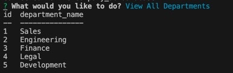

# Employee-Tracker

## Description

In this project, I created a command line apllication using Node.js that allows the user to track employee information for a company. The apllication prompts the user with choices/questions that allow them to create and view the company's departments, roles, and employees.

## License:  

## Table of Contents
1. [Description](#description)
2. [Installation](#installation)
3. [Usage](#usage)
4. [Credits](#credits)
5. [Contributing](#contributing)
6. [License](#license)
7. [Questions](#questions)

## Installation

In order for this application to work you will need the node environment and MySql installed on your computer. Adequate instructions for downloading the node environment can be found at nodejs.org. Instructions for downloading MySql can be found at mysql.com. To install all dependencies for this program, start by opening the index.js file in an integrated terminal and run "npm install".

## Usage
1. Make sure all dependencies are installed by running npm install.
2. Source and seed the database by opening the db folder in an integrated terminal, and running mysql -u root -p. You'll need to create a .env file that holds your database name, password and user.
3. To start the application open the index.js file in an integrated terminal and run node index.js
4. From here you will be prompted with questions that will allow you to view all departments, roles, and employees, or add to these categories.
  
  

A walkthrough video can be seen via this link: https://watch.screencastify.com/v/GkSgTNU0OoFbKmEivh0X

## Credits

- MDN Web Docs
- Tutor: Aaron Centeno
- npmjs.com
- mysql.com
- VSCode
- StackOverflow

## Contributing

  
For contributing guidelines see link : https://www.contributor-covenant.org/

## License 
This Project is licensed under the MIT license.

* https://opensource.org/licenses/MIT

## Questions

Follow link for github: [Github Profile] (https://github.com/gallaghj13)  
For any additional questions you can reach me at: gallagherj0913@gmail.com